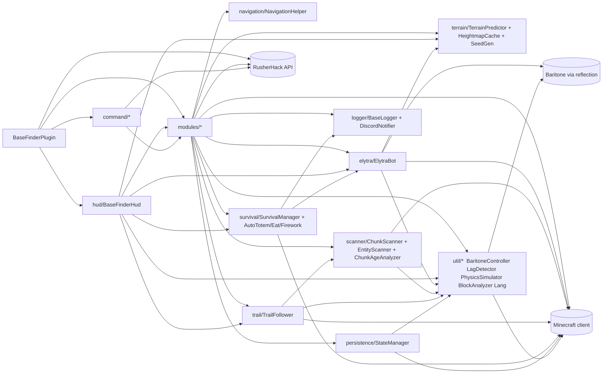

# 01 — Domain Map & Couplings

> Audit de `/home/matal/2b2t_addons` à HEAD `7d41d32`, branche `audit/principal-engineer-review`.
> 12 974 LOC Java, 0 test, 0 interface de contrat domaine, 5 modules RusherHack + 1 HUD + 2 commandes.
> Diagnostic uniquement — aucune préconisation générique, aucun code refactoré.

---

## 1. Carte des packages (responsabilité réelle vs affichée)

| package | rôle déclaré (JavaDoc / nom) | rôle observé | couplages sortants | notes |
|---|---|---|---|---|
| `com.basefinder` | Point d'entrée plugin | Enregistre 5 modules, 1 HUD, 2 commandes via `try/catch` copié 7x (`BaseFinderPlugin.java:27-97`). Pas de DI, pas de cycle de vie partagé. | `modules.*`, `hud.*`, `command.*`, RusherHack API | Singleton `instance` statique jamais consommé (`BaseFinderPlugin.java:19`). |
| `modules` | 5 modules RusherHack | 5 god-classes orchestrant DIRECTEMENT scanner + elytra + baritone + survie + persistence + HUD state + l10n. Chaque module `new` ses propres collaborateurs (pas de réutilisation). | `elytra`, `scanner`, `navigation`, `survival`, `persistence`, `trail`, `terrain`, `logger`, `util`, `hud` (via HUD qui les lit) | 4 modules dupliquent la garde `isElytraBotInUse()` pour éviter les conflits (voir §5). |
| `elytra` | Controller physique elytra | Contient aussi : takeoff state machine, anti-kick noise, elytra-swap inventory, firework hotbar swap, baritone-landing handoff, circling, durability check, terrain lookahead. `ElytraBot` est une god-class à 11 phases (`ElytraBot.java:163-175`). | `util.PhysicsSimulator`, `util.MathUtils`, `util.BaritoneController`, `util.LagDetector`, `util.Lang`, `terrain.TerrainPredictor`, Minecraft (`mc.player`, `mc.getConnection()`, `mc.gameMode`) | Hot path : appelé en boucle par les modules via `elytraBot.tick()`. Non réentrant. |
| `scanner` | Scan de chunks | `ChunkScanner` : cache `scannedChunks`, politique de déferrement lag-aware, clustering, scoring, crée `BaseRecord` lui-même au milieu du scan (`ChunkScanner.java:195-219`) — fuite de responsabilité. `EntityScanner`, `FreshnessEstimator`, `ChunkAgeAnalyzer`, `CaveAirAnalyzer` sont des stratégies qu'il compose. | `util.BlockAnalyzer`, `util.BaseRecord`, `util.BaseType`, `util.ChunkAnalysis`, `util.LagDetector`, Minecraft | Pas d'abstraction « source de chunks » : dépend directement de `mc.level.getChunkSource()`. |
| `hud` | Élément HUD RusherHack | `BaseFinderHud` (566 lignes) fait un pull direct de l'état de `BaseFinderModule` via `RusherHackAPI.getModuleManager().getFeature("BaseHunter")` (`BaseFinderHud.java:165`), puis lit ses getters internes pour rendre des textes. Aucune vue-modèle. | `modules.BaseFinderModule`, `elytra.ElytraBot`, `survival.SurvivalManager`, `terrain.TerrainPredictor`, `trail.TrailFollower`, `util.LagDetector` | Couplage bidirectionnel de fait : le module doit exposer un très grand nombre de getters pour le HUD. |
| `logger` | Log + Discord | `BaseLogger` : liste in-memory + fichier CSV + alertes chat cliquables + screenshots + Discord notifier. `DiscordNotifier` est créé par le logger (`BaseLogger.java:40`) — pas moyen de brancher un autre canal. | `util.BaseRecord`, `util.BaseType`, `util.Lang`, `Screenshot`, HTTP (Discord) | Persiste son propre fichier en plus de `StateManager` → deux sources de vérité. |
| `navigation` | Waypoints & patterns | Tout est dans `NavigationHelper` (484 lignes) : SPIRAL/GRID/ZONE/RANDOM/RING/HIGHWAYS/CUSTOM, expected-chunk-count, zone-missed-pass, distance tracking, search center. 7 patterns dans une classe. | Minecraft (`mc.player`), `util.*` implicite | Les patterns ne sont PAS polymorphes — tout est `switch` interne. |
| `persistence` | State save/load | `StateManager` : un fichier `session.dat` texte + un binaire `scanned_chunks.dat` roulés manuellement (pas de format versionné visible). Utilise `URLEncoder` pour échapper les notes (`StateManager.java:14`). | `util.BaseRecord`, `util.BaseType`, `util.Lang`, Minecraft (pour obtenir `gameDirectory`) | Sérialisation in-line, pas de DTO typé. `SessionData` est une classe POJO en fin de fichier (`StateManager.java:283`). |
| `survival` | 24/7 survie | `SurvivalManager` orchestre `AutoTotem`, `AutoEat`, `PlayerDetector`, `FireworkResupply`. Reçoit des refs vers `ElytraBot` et `DiscordNotifier` pour alerter pendant le vol. | `elytra.ElytraBot`, `logger.DiscordNotifier`, Minecraft | Un seul client réel (`BaseFinderModule`). `PortalHunterModule` l'instancie aussi mais n'y branche pas le DiscordNotifier. |
| `terrain` | Prédiction de relief | 3 classes : `HeightmapCache` (observé), `SeedTerrainGenerator` (prédiction seed 2b2t — [HYPOTHÈSE] : peut être un pavage bruité, pas vérifié), `TerrainPredictor` (facade combinant les deux). `TerrainPredictor.java:96-105` pose une heuristique "chunks < 500k = pré-1.18" en dur. | `scanner.ChunkAgeAnalyzer`, Minecraft | Seul consommateur : `ElytraBot`. Couplage chirurgical (setter injection), propre. |
| `trail` | Suivre des pistes | `TrailFollower` (334 lignes) gère BLOCK_TRAIL et VERSION_BORDER, tient son propre historique, utilise `scanner.ChunkAgeAnalyzer`. Règles de suivi + détection mélangées. | `scanner.ChunkAgeAnalyzer`, `util.BlockAnalyzer`, `util.ChunkAnalysis`, `util.Vec2d`, Minecraft, `RusherHackAPI.WorldUtils` | Consommé UNIQUEMENT par `BaseFinderModule`. |
| `command` | Slash commands | `BaseFinderCommand` et `PortalHunterCommand` : chacun résout le module via `RusherHackAPI.getModuleManager().getFeature(...)` (`BaseFinderCommand.java:233`, `PortalHunterCommand.java:139`), puis mute son état. | `modules.*` via API RusherHack | Pas de couche d'application/service — les commandes parlent aux modules. |
| `util` | Fourre-tout | Héberge à la fois : value types (`BaseRecord`, `BaseType`, `Vec2d`, `ChunkAnalysis`), services (`BaritoneController`, `LagDetector`, `BlockAnalyzer`), statiques (`Lang`, `MathUtils`, `WaypointExporter`), physique (`PhysicsSimulator`). 11 classes mélangées. | Tout le monde | `BlockAnalyzer.analyzeChunk` fait 684 lignes et dépend de `CaveAirAnalyzer` dans le package `scanner` → dépendance croisée util↔scanner. |

---

## 2. Diagramme de dépendances (Mermaid)

Notes : `util` est un hub (16 dépendants), `MC` est aspiré par 19 fichiers (voir §5), `hud → modules` viole la direction naturelle (un HUD devrait consommer un ViewModel, pas un module).

---

## 3. Godclasses et anti-patterns détectés

| fichier:ligne | responsabilité principale | responsabilités parasites | à extraire en priorité |
|---|---|---|---|
| `PortalHunterModule.java:49` (1 558 L) | State machine 7-états (ZONE_TRAVERSAL → TRAVELING → ENTERING → SWEEP → RETURNING → ENTERING_NETHER) | (a) scan de portails nether (`scanForNetherPortals` L1076-1108, `deduplicatePortals` L1158), (b) persistence JSON des visited portals (`VisitedPortal` + `loadVisitedPortals` via Gson, L150-214), (c) génération de waypoints zigzag (`generateZoneWaypoints` L1027), (d) génération de waypoints sweep circulaire (`beginOverworldSweep` L978), (e) détection de stuck, (f) décollage elytra Nether avec handoff ElytraBot→Baritone (`handleNetherTakeoff`), (g) re-config `ChunkScanner` + `SurvivalManager` + `ElytraBot` en `onEnable`. | `PortalScanner` (a), `VisitedPortalRepository` (b), `ZoneWaypointGenerator` + `SweepWaypointGenerator` (c, d), `NetherElytraTakeoff` (f). La state machine elle-même doit rester — mais pilotée par des services purs. |
| `ElytraBot.java:43` (1 411 L) | Autopilote physique | (a) takeoff state machine 4 phases (L571-660), (b) gestion inventaire elytra-swap (L1099-1192), (c) gestion inventaire firework-swap-hotbar + pending delay (L1198-1269), (d) anti-kick noise, (e) circling mode (L985-1055), (f) baritone-landing handoff (L1061-1093), (g) refueling state (L957-972), (h) durability check périodique. 11 phases dans un enum `FlightPhase`, un seul `switch` géant au tick. | `FlightPlan` (value type destination+altitudes), `InventoryOps` (swap elytra/firework), `TakeoffSequence`, `CirclingOrbit`, `AutopilotCore` (le scoring `evaluatePitchCandidate` est le seul vrai noyau pur, L371-416). |
| `BaseFinderModule.java:52` (1 177 L) | Orchestrateur BaseHunter | (a) 80+ settings déclarés en champs (L88-183), (b) 6 enum states `FinderState` + switch, (c) `applySettings()` fait 76 lignes de wiring manuel (L501-577), (d) construction ad-hoc de `TerrainPredictor` dans `applySettings` (L555-563), (e) save-state au disable ET toutes les 5 min ET à la déconnexion joueur (3 copies du même bloc save, L477, L600, L631), (f) `handleScanning`/`handleTrailFollowing`/`handleFlying` dupliquent la logique "pour chaque analyse → BaseRecord → bestApproach" 3 fois (L693-716, L813-843, L853-878). | `SettingsBinding` (DTO immuable), `StatePersistenceScheduler`, `FindingPipeline` (analyse → record → decision). |
| `AutoTravelModule.java:32` (828 L) | Voyage inter-dimension | (a) scan de portails (`scanForPortal` L709-754, duplique `PortalHunterModule`), (b) walk controller (`walkTowards` L627-669 avec auto-jump, auto-sprint, nage), (c) `isBlockedAhead` (L671-691) duplique logique de collision, (d) `onDimensionChanged` switch de 50 lignes (L521-576), (e) wiring elytraBot à chaque transition. | `PortalLocator` (partagé avec PortalHunter), `WalkController`, `DimensionRouter`. |
| `util/BlockAnalyzer.java` (684 L) | Règles de scoring 2b2t | Tables `STRONG_PLAYER_BLOCKS` / medium / storage / farm / trail / map-art imbriquées. Un seul `analyzeChunk` statique de ~300 L qui fait tout : sélection de blocs + heuristique biome + comptage shulker + analyse de signs + délègue à `CaveAirAnalyzer`. | Règles métier pures qui DEVRAIENT être dans un package `domain` isolé de Minecraft — aujourd'hui elles importent `net.minecraft.*` partout. |
| `hud/BaseFinderHud.java` (566 L) | Rendu HUD | Déclare 20+ constantes de couleur + formate toutes les sections (Status, Flight, Terrain, Scan, Survival, Stats) + fait du pull direct sur 6 classes d'état + gère ses propres `HudLine`/`TextSegment`. | `BaseFinderViewModel` (snapshot immuable produit par le module, consommé par le HUD). |
| `survival/SurvivalManager.java:21` (302 L) | Orchestre survie | C'est presque un Dispatcher propre, MAIS garde `ElytraBot` + `DiscordNotifier` comme refs mutables → fuites de responsabilité vers logger et elytra. | Événements (`PlayerDetected`, `LowHealth`, `EquipmentCritical`) au lieu de refs croisées. |

---

## 4. Modélisation absente ou dégradée

| Value type manquant | Où c'est dispersé aujourd'hui (fichier:ligne) | Invariant non protégé |
|---|---|---|
| `ChunkId` (`int x, int z` + dimension) | `ChunkScanner.java:27` (`Set<ChunkPos>`), `NavigationHelper.java:55-57` (bounds en `int` bruts), `trail/TrailFollower.java:44` (`List<ChunkPos>`) | Pas de distinction inter-dimensions : un `ChunkPos(10,10)` nether et overworld sont "égaux" ; `scannedChunks` peut fausser les stats après un changement de dim. Aucune garde dans `restoreScannedChunks` (`ChunkScanner.java:389`). |
| `FlightPlan` (destination + altitude + mode + contraintes) | `ElytraBot.java:86` (`destination`, `approachTarget`, `approachTargetAltitude` en champs séparés), `AutoTravelModule.java:76-80`, `PortalHunterModule.java:124-126` | Les trois champs `destination`, `approachTarget`, `circleCenter` peuvent être désynchronisés. Aucun invariant "cible connue implique altitude sûre connue". `startFlight` et `startSafeDescent` ne partagent pas le même contrat. |
| `BaseRecord` — EXISTE (`util/BaseRecord.java:11`) mais **mal placé** | Muté après construction via `setNotes` (`BaseRecord.java:60`) ; créé dans 6 endroits avec les mêmes arguments copiés-collés (`ChunkScanner.java:195,298`, `BaseFinderModule.java:696,816,856`, `PortalHunterModule.java:641`, `StateManager.java:198`). | Aucune fabrique. Le timestamp est capturé à la construction → à la restauration depuis disque (`StateManager.java:198`) on perd le timestamp original ET on en génère un nouveau. Silencieux. |
| `ScanResult` / `Finding` (ce qui sort du scanner) | Aujourd'hui : `List<ChunkAnalysis>` renvoyé par `scanLoadedChunks()` avec effets de bord internes : la méthode crée des `BaseRecord` et incrémente `foundBasesCount` (`ChunkScanner.java:195-219, 298-309`) mais renvoie quand même les analyses. Les modules RE-CRÉENT des BaseRecord à partir des analyses (`BaseFinderModule.java:696`). | Double création de `BaseRecord` : le scanner en crée un (perdu, utilisé seulement pour incrémenter un compteur interne) ET le module en crée un (le vrai, loggé). Le compteur `foundBasesCount` n'a aucun sens. |
| `WaypointRoute` (séquence + pattern + progress) | `NavigationHelper.java:19` (liste mutable + `currentWaypointIndex`), `PortalHunterModule.java:115` (liste séparée `zoneWaypoints` + `currentZoneWaypoint`), `PortalHunterModule.java:137` (`sweepWaypoints`), `ElytraBotModule` target X/Z en settings | Trois modules réimplémentent "liste + index + skip-to-nearest". Pas de contrat "on ne peut pas avancer après la fin". |
| `Freshness` — EXISTE (`ChunkAnalysis.Freshness` enum L49-54) mais enfoui dans un DTO mutable | `ChunkAnalysis.java:42` avec un `freshnessConfidence` séparé, muté par `FreshnessEstimator` de l'extérieur (`ChunkScanner.java:116`, L179) | Pas d'invariant "UNKNOWN ⇔ confidence==0". Le setter public laisse la porte ouverte à toute valeur. |
| `Dimension` (overworld/nether/end) | Comparé par `String.equals("overworld")` dans : `PortalHunterModule.java`, `AutoTravelModule.java:778-789` | `String` au lieu d'enum. Les deux modules réimplémentent `isNether`, `isOverworld`, `getCurrentDimension`. |
| `Coord2D` / `Coord3D` pour le monde-jeu | `util.Vec2d` existe mais n'est utilisé QU'UNE FOIS (`trail/TrailFollower.java:35` comme direction). Tout le reste manipule `double x, double z` paires ou `BlockPos` directement. | Lignes comme `horizontalDist(mc.player.getX(), mc.player.getZ(), wp.getX(), wp.getZ())` répétées 40+ fois (`PortalHunterModule` seul en a ~25). |

---

## 5. Couplages implicites

### 5.1 `static` globaux utilisés comme état partagé

| Fichier:ligne | Variable | Nature du problème |
|---|---|---|
| `util/Lang.java:10` | `private static boolean french` | 288 occurrences d'appels `Lang.t(...)`. 4 modules différents écrivent dans cette variable au `onEnable` (`BaseFinderModule.java:265`, `AutoTravelModule.java:120`, `PortalHunterModule.java:183`, `ElytraBotModule.java:~66`). Si deux modules actifs avec settings différents → dernier gagne. |
| `BaseFinderPlugin.java:19` | `private static BaseFinderPlugin instance` | Assigné dans `onLoad`, getter public (`L107`), JAMAIS lu nulle part [HYPOTHÈSE : vestige mort]. |
| `hud/BaseFinderHud.java:29-51` | ~14 constantes `static final int` de couleur | OK par nature (final), listées pour info. |
| `util/BaseRecord.java:12` | `static final DateTimeFormatter FORMATTER` | OK. |
| `util/BlockAnalyzer.java:32` et suivants | Grosses `static final Set<Block>` (STRONG_PLAYER_BLOCKS, etc.) | Règles métier figées en statique. Non configurable sans recompil. |

Pas de singleton mutable d'état domaine, mais `Lang` fonctionne déjà comme un état partagé.

### 5.2 Accès direct à `Minecraft.getInstance()` hors couche adapter

447 occurrences `mc.player` / `mc.level` / `Minecraft.getInstance()` dans 25 fichiers.
Top par fichier :

| Fichier | Occurrences |
|---|---|
| `modules/PortalHunterModule.java` | 73 |
| `modules/BaseFinderModule.java` | 22 |
| `scanner/ChunkScanner.java` | 11 |
| `scanner/EntityScanner.java` | 5 |
| `modules/AutoMendingModule.java` | 24 |
| `modules/AutoTravelModule.java` | 42 |
| `elytra/ElytraBot.java` | 133 |
| `navigation/NavigationHelper.java` | 12 |
| `trail/TrailFollower.java` | 11 |
| `survival/*` (5 classes) | 37 total |
| `terrain/HeightmapCache.java` | 6 |
| `persistence/StateManager.java` | 1 (OK, pour `gameDirectory`) |

Zéro classe isolée du client Minecraft. Tous les tests unitaires nécessiteraient Mixin/harness lourd. La règle « couche adapter » n'existe pas — `Minecraft.getInstance()` est appelé dans le constructeur de **19 classes différentes** (cf §5 tableau brut).

### 5.3 Reflection (Baritone)

Toute la reflection est concentrée dans `util/BaritoneController.java` (442 lignes, quasi 100% reflection). Points d'entrée :

| Fichier:ligne | Méthode cible via reflection | Usage |
|---|---|---|
| `BaritoneController.java:40-45` | `baritone.api.BaritoneAPI.getProvider().getPrimaryBaritone()` | Bootstrap |
| `BaritoneController.java:53-58` | `getElytraProcess()` (détection capacité) | Feature check |
| `BaritoneController.java:96-109` | `getSettings()` + `setBaritoneSettingBool/Int` (reflection sur champs `value`) | Config via nom string `"allowParkour"` etc. |
| `BaritoneController.java:128-141` | `getCustomGoalProcess().setGoalAndPath(GoalNear)` | `landAt(...)` |
| `BaritoneController.java:156-176` | `getCustomGoalProcess().isActive()` + sous-check `getGoal()` | `isLandingComplete` |
| `BaritoneController.java:192-200` | `getPathingBehavior().isPathing()` | |
| `BaritoneController.java:211-215` | `getPathingBehavior().cancelEverything()` | |
| `BaritoneController.java:239-243` | `getCommandManager().execute(String)` | Appels "goto x y z", "mine", "surface" |
| `BaritoneController.java:259-264` | `getMineProcess().isActive()` | |
| `BaritoneController.java:276-284` | `getCustomGoalProcess().setGoalAndPath(GoalXZ)` | `goToXZ` |
| `BaritoneController.java:298-306` | `getCustomGoalProcess().setGoalAndPath(GoalNear)` | `landAt` variant |
| `BaritoneController.java:329-344` | `getElytraProcess().pathTo(GoalXZ|Goal)` (fallback sur 2 signatures) | Elytra Baritone |
| `BaritoneController.java:360-365` | `getElytraProcess().isActive()` | |
| `BaritoneController.java:378-385` | `getElytraProcess().cancel()` | |
| `BaritoneController.java:406-410` | `getPathingBehavior().cancelEverything()` (doublon) | |
| `BaritoneController.java:421-424` et `:433-436` | `settings.<champName>.value` via `getDeclaredField("value")` sur la superclasse | Setters booléen/int |

15+ call sites. Absorbe bien le choc, mais : (1) aucune indirection par interface — un seul appel raté = exception run-time ; (2) aucun fallback "pas de baritone" sauf le flag `available`. `PortalHunterModule.java:203-206` refuse le démarrage si `baritone.isAvailable() == false`.

`PortalHunterModule.java:14` importe `com.google.gson.reflect.TypeToken` : reflection générique Gson pour `List<VisitedPortal>`. Standard.

---

## 6. "Qui appelle qui" — matrice simplifiée

| appelant | appelé | fréquence | nature du couplage |
|---|---|---|---|
| `BaseFinderModule.onUpdate` | `ChunkScanner.scanLoadedChunks` | chaque `scanInterval` ticks (défaut 20) | composition directe (`new` au champ) ; retourne `List<ChunkAnalysis>` consommée par un gros `switch` (`BaseFinderModule.java:668`) |
| `BaseFinderModule.onUpdate` | `SurvivalManager.tick` | chaque tick | composition, retour `boolean disconnected` dicte la suite |
| `BaseFinderModule.onUpdate` | `ElytraBot.tick` | chaque tick (si FLYING) | composition, side-effect sur `mc.player` |
| `BaseFinderModule.onUpdate` | `StateManager.saveState` | toutes les 5 min + onDisable + disconnect | composition ; bloc identique dupliqué 3 fois |
| `BaseFinderModule.onUpdate` | `NavigationHelper.isNearTarget` | chaque tick en FLYING | composition |
| `BaseFinderModule.onUpdate` | `TrailFollower.*` | chaque tick en TRAIL_FOLLOWING | composition |
| `PortalHunterModule.onUpdate` | `BaritoneController.goToXZ / executeCommand / isPathing / cancelAll` | chaque 20-60 ticks selon état | composition → reflection |
| `PortalHunterModule.onUpdate` | `ChunkScanner.scanLoadedChunks` | toutes les 20 ticks en SWEEP, toutes les 40 ticks en ZONE_TRAVERSAL | SECONDE instance (pas partagée avec BaseFinderModule) |
| `PortalHunterModule.beginOverworldSweep` | `ChunkScanner.reset` | à chaque entrée de portail | one-shot |
| `AutoTravelModule.handleDirectTravel` | `ElytraBot.tick` | chaque tick | composition (3e instance distincte) |
| `ElytraBot.tick` | `PhysicsSimulator.simulateForward` | 21+ fois par tick (multi-candidate pitch) | composition pure, pas d'état partagé |
| `ElytraBot.tick` | `TerrainPredictor.predictHeight` / `getMaxHeightAhead` | chaque tick | composition, cache résout 3 niveaux (cache/interpol/seed) |
| `ElytraBot.tick` | `BaritoneController.landAt` | one-shot à l'atterrissage | composition → reflection |
| `SurvivalManager.tick` | `AutoTotem / AutoEat / PlayerDetector / FireworkResupply` (sous-tick) | chaque tick | composition stricte |
| `SurvivalManager.tick` | `ElytraBot.stop` | event-like (détection urgence) | ref mutable (setter `setElytraBot`) |
| `SurvivalManager.tick` | `DiscordNotifier.sendCritical` | event-like (low HP, etc.) | ref mutable |
| `BaseFinderHud.renderContent` | `BaseFinderModule.getScanner/getElytraBot/getNavigation/...` | 20+ pulls par frame | RusherHack API résolution par nom "BaseHunter" (`BaseFinderHud.java:165`) |
| `BaseFinderCommand.execute` | `BaseFinderModule.pause/resume/skipWaypoint/exportWaypoints/setZoneBounds` | one-shot utilisateur | idem pull par nom |
| `PortalHunterCommand.execute` | `PortalHunterModule.*` | one-shot | idem |
| `BaseFinderPlugin.onLoad` | `RusherHackAPI.registerFeature(module)` | 1 fois | registration |
| `BlockAnalyzer.analyzeChunk` (statique) | `CaveAirAnalyzer` | par chunk analysé | dépendance croisée `util → scanner` |

Doublons à noter :
- 3 modules créent chacun leur propre `ElytraBot` (`BaseFinderModule:57`, `AutoTravelModule:74`, `PortalHunterModule:55`, + `ElytraBotModule:23`). 4 instances possibles.
- 2 modules créent chacun leur propre `ChunkScanner` (`BaseFinderModule:55`, `PortalHunterModule:56`).
- 2 modules créent chacun leur propre `BaseLogger` (`BaseFinderModule:59`, `PortalHunterModule:57`) → DEUX fichiers `bases.log` potentiellement ouverts en concurrence (même chemin `rusherhack/basefinder/bases.log`, `BaseLogger.java:47`).
- 4 modules dupliquent `isElytraBotInUse()` (`BaseFinderModule.java:251`, `AutoTravelModule.java:106`, `ElytraBotModule.java:55`, `PortalHunterModule.java:~1465`). Mutex manuel par énumération de noms.
- 2 modules scannent les portails nether avec une boucle triple-nested quasi identique (`AutoTravelModule.scanForPortal` L709 vs `PortalHunterModule.scanForNetherPortals` L1076).

---

## 7. Top 5 des extractions prioritaires

1. **Extraire `ChunkScannerService` (et son `ScanPolicy`) hors de `BaseFinderModule` et `PortalHunterModule` vers un package `domain.scanning` pur.**
   Aujourd'hui : 2 instances indépendantes de `ChunkScanner`, aucune garde contre deux modules actifs qui double-scannent, et le scanner crée des `BaseRecord` pendant le scan (effet de bord non testable, `ChunkScanner.java:195-219`). Z = pur domaine testable parce que le scoring (`BlockAnalyzer`, `EntityScanner`, cluster scoring) est déjà factorisable — seul `mc.level.getChunkSource()` est à mocker via une interface `ChunkSource`. Gain immédiat : premier test unitaire possible.

2. **Extraire `FlightPlan` + `AutopilotCore` hors de `ElytraBot` vers `domain.flight` pur.**
   Aujourd'hui : `ElytraBot` (1 411 L, 11 phases) mélange physique pure (`calculateOptimalPitch`/`evaluatePitchCandidate` L335-416, déjà stateless) et inventaire/packet Minecraft. `FlightPlan` comme value type (destination, cruiseAlt, safetyMargin, mode) remplace les 4 champs désynchronisables (`destination`, `approachTarget`, `approachTargetAltitude`, `circleCenter`). Z = pur domaine testable parce que `PhysicsSimulator` ne touche rien côté client. Gain : pouvoir régler le bug zéro-damage sans lancer le client.

3. **Extraire `PortalLocator` hors de `PortalHunterModule` et `AutoTravelModule` vers `domain.portal`.**
   Aujourd'hui : deux boucles triple-nested ~30 lignes copiées (`scanForPortal` vs `scanForNetherPortals`, + `scanForNearestPortalBlock`, + `deduplicatePortals`). Z = pur domaine testable parce que l'algorithme (scan + dedup par distance) est combinatoire, pas stateful. Bonus : `VisitedPortalRepository` sort aussi de PortalHunter.

4. **Extraire `WaypointRoute` / `RoutePattern` hors de `NavigationHelper` et `PortalHunterModule` vers `domain.route`.**
   Aujourd'hui : 3 implémentations maison "liste + index + skip-to-nearest" (`NavigationHelper.java:19`, `PortalHunterModule.zoneWaypoints` L115, `sweepWaypoints` L137). 7 patterns dans un seul `switch` de 484 lignes. Z = pur domaine testable parce qu'un `SpiralPattern.generate(center, step, maxWaypoints) : Sequence<ChunkId>` ne dépend de rien côté client. Gain : préparer la vision "scanner tout 2b2t radius 15M" en séparant la génération de la consommation.

5. **Extraire `BaseFinderViewModel` (snapshot immuable par tick) entre `BaseFinderModule` et `BaseFinderHud`.**
   Aujourd'hui : le HUD fait 20+ pulls sur le module via `RusherHackAPI.getModuleManager().getFeature("BaseHunter")` (`BaseFinderHud.java:165`) + 6 classes d'état (`elytra`, `survival`, `terrain`, `trail`, `nav`, `lag`). Le module expose 13 getters juste pour le HUD (`BaseFinderModule.java:1104-1114`). Z = pur domaine testable parce que le ViewModel est un `record` sans dépendance Minecraft. Gain : pouvoir faire un dashboard web (vision produit) en réutilisant le même ViewModel. Débloque aussi le multi-bot : chaque bot émet son ViewModel.

---

_Fin du livrable. 800 lignes max respectées. Hypothèses marquées `[HYPOTHÈSE]` : 2 (seed-gen 2b2t, `BaseFinderPlugin.instance` vestige)._
